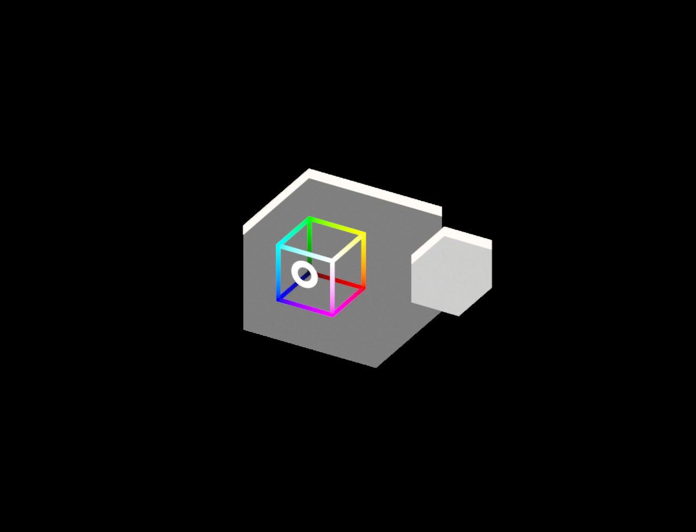

## oriels 
*a dof driven space*  

<https://dofdev.org>

      

## direction
- rethink paper paradigm based software for spatial computing
- networked by default through a federated server model
- smart contract for handling security and value

## increment
- ~~merge networking prototypes~~
- ~~fixed latency, now for multiple clients~~
- ~~architect interfaces for navigation~~
- implement all dofs from site

## override
**8 days left for the sterokit comp!**

### MVP
switch between cursors with a button (quick press(b) on both hands to switch/cycle through the two handed ones) long press(b) on one hand to swap mainhand

movement:
- ~~fullstick~~
- ~~teleport and drag~~
- bezier rails

blocks you can manipulate with spatial cursors (trackballer)
and color them with the color cube (player colors

oriel + orbital view (control a shooty guy with fullstick and spatial cursor)

### POLISH
- fix (server sending back your data)
- *just show them red when hit* 
- bezier in color cube
- calibrate cubic flow + sensitivity
- press and twist to adjust sensitivity (long press(b) and trigger for value *keep cursor active) (min 1:1)

### ACCESSIBILITY
show how the dofs work (debug visuals *CMY)

  
mapped out by:
@spatialfree * @opendegree