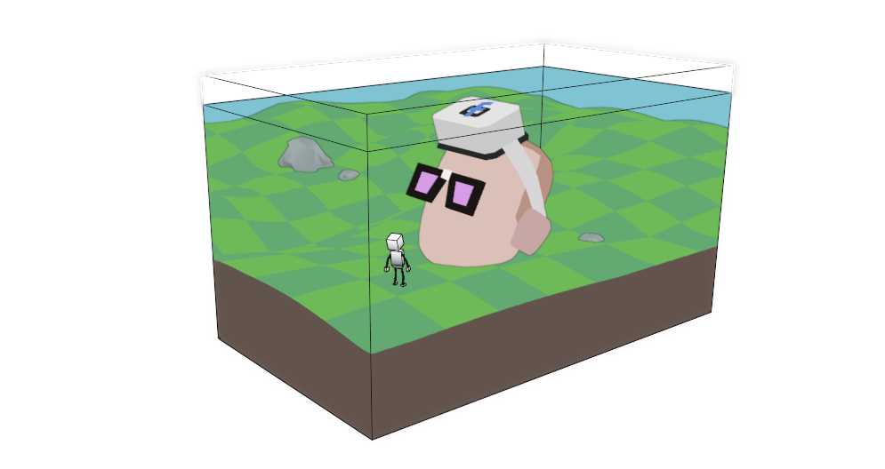

<code>

# oriels
*a dof driven space*  

# pos
net.read()

c[] = reach-cursor * trackballer || cubic-flow

blocks.step(c[0].pose, c[3].pose)

cubics.step(c[0].pos, c[1].pos, c[2].pos, c[3].pos)

net.write()

oriel.raymarch()

&nbsp;

# dir
= (dof - paperParadigm).normalized

accounts = web3()

&nbsp;

# m++
refactor(hackathon.result())

oriel manipulation

dofs.debug(CMY)

cursor combinatory mechanism

oriels.dofs == site.dofs

init(oriel-game)

exec(vlai)

&nbsp;

# m--
unity

&nbsp;

## p = effort * <a href='https://dofdev.org'>funds</a>
## vel = p / m
## pos += dir * vel * time

&nbsp;

&nbsp;

&nbsp;

mapped out by:
<a href='https://ethanmerchant.com'>@spatialfree</a> x <a href='https://twitter.com/opendegree'>@opendegree</a>

</code>